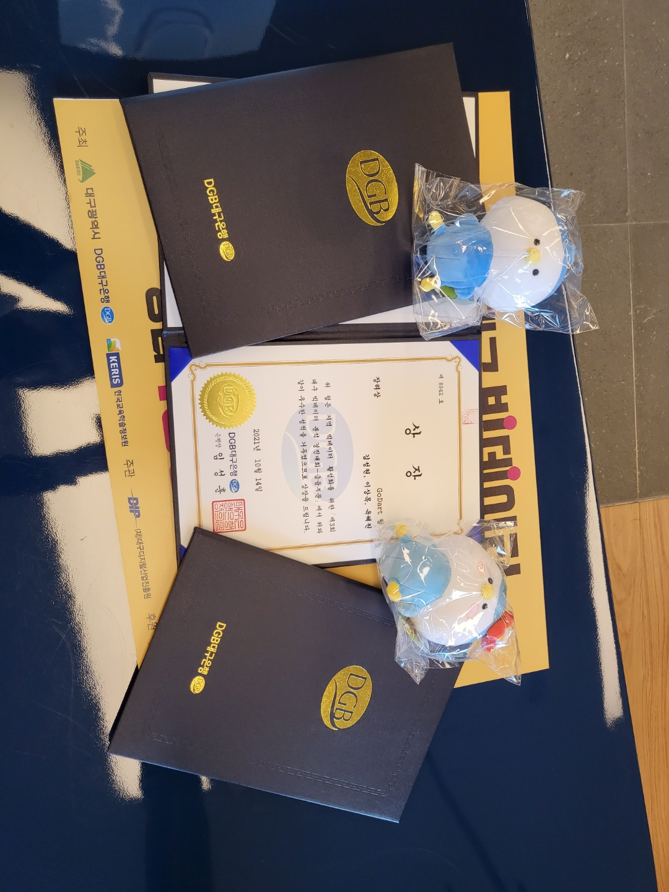

# 경제변수를 활용한 초개인화 서비스 제안

> 딥러닝을 통해 경제변수 변화에 따른 금융시장 참여자의 행동 변화를 예측·분석하여 초개인화된 금융상품과 서비스를 추천 및 개발할 수 있도록 한다

_리포지토리의 코드는 pytorch로 구현한 분류 모델입니다.  세부 구조 및 정보는 아래 분석 결과 문서에서 확인할 수 있습니다._

## [제3회 대구 빅데이터 분석 경진대회](https://www.dip.or.kr/home/notice/boardRead.ubs?fboardcd=notice&fboardnum=5066)
 - 금융분야 참여
 - 분석 계획 발표(3배수) 후 실제 분석에 돌입하여 분석 결과 발표(2배수)

### 분석 계획 문서
 - [분석 계획서](./documents/과제분석계획서_GoDart.pdf)
 - [발표자료](./documents/1차발표자료_GoDart.pdf)

### 분석 결과 문서
 - [분석 보고서](./documents/경진대회_분석보고서_GoDart.pdf)
 - [발표자료](./documents/경진대회_발표자료_GoDart.pdf)

#### 일정
 - 분석 계획서 마감(2021.06.04)
 - 분석 계획 발표(2021.07.27, SW융합테크비즈센터)
 - 분석 결과 발표(2021.09.27, SW융합테크비즈센터)
 - 시상식(2021.10.14, 대구은행 본점)

#### 최종 결과
 - 장려상
    > 
 - [후기](https://snmhz.github.io/daegu-bigdata-competition-2021)